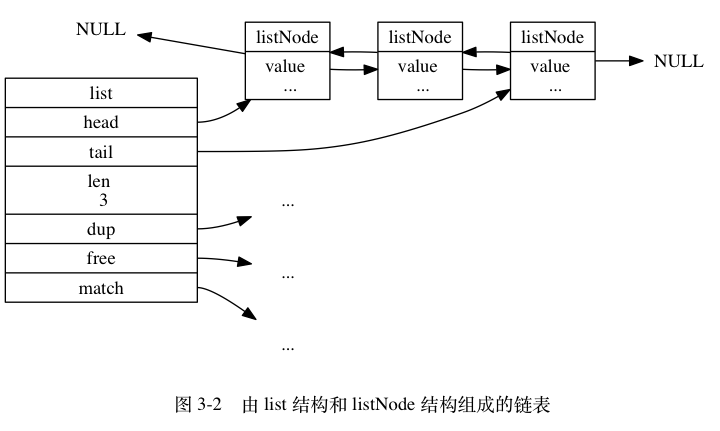

链表提供了高效的节点重排能力， 以及顺序性的节点访问方式， 并且可以通过增删节点来灵活地调整链表的长度。

链表在 Redis 中的应用非常广泛， 比如列表键的底层实现之一就是链表： 当一个列表键包含了数量比较多的元素， 又或者列表中包含的元素都是比较长的字符串时， Redis 就会使用链表作为列表键的底层实现。

由于C语言自身没有链表的实现，redis 自定定义了一套链表的实现

# 链表的定义

每个链表节点使用一个 `adlist.h/listNode` 结构来表示：

```c
typedef struct listNode {

    // 前置节点
    struct listNode *prev;

    // 后置节点
    struct listNode *next;

    // 节点的值
    void *value;

} listNode;
```

多个 `listNode` 可以通过 `prev` 和 `next` 指针组成双端链表


redis 还有一个数据结构来简化链表的操作

```c
ypedef struct list {

    // 表头节点
    listNode *head;

    // 表尾节点
    listNode *tail;

    // 链表所包含的节点数量
    unsigned long len;

    // 节点值复制函数
    void *(*dup)(void *ptr);

    // 节点值释放函数
    void (*free)(void *ptr);

    // 节点值对比函数
    int (*match)(void *ptr, void *key);

} list;
```

`list` 结构为链表提供了表头指针 `head` 、表尾指针 `tail` ， 以及链表长度计数器 `len` ， 而 `dup` 、 `free` 和 `match` 成员则是用于实现多态链表所需的类型特定函数：

- `dup` 函数用于复制链表节点所保存的值；
- `free` 函数用于释放链表节点所保存的值；
- `match` 函数则用于对比链表节点所保存的值和另一个输入值是否相等。



Redis 的链表实现的特性可以总结如下：

- 双端： 链表节点带有 `prev` 和 `next` 指针， 获取某个节点的前置节点和后置节点的复杂度都是 O(1) 。
- 无环： 表头节点的 `prev` 指针和表尾节点的 `next` 指针都指向 `NULL` ， 对链表的访问以 `NULL` 为终点。
- 带表头指针和表尾指针： 通过 `list` 结构的 `head` 指针和 `tail` 指针， 程序获取链表的表头节点和表尾节点的复杂度为 O(1) 。
- 带链表长度计数器： 程序使用 `list` 结构的 `len` 属性来对 `list` 持有的链表节点进行计数， 程序获取链表中节点数量的复杂度为 O(1) 。
- 多态： 链表节点使用 `void*` 指针来保存节点值， 并且可以通过 `list` 结构的 `dup` 、 `free` 、 `match` 三个属性为节点值设置类型特定函数， 所以链表可以用于保存各种不同类型的值。

# 总结

- 链表被广泛用于实现 Redis 的各种功能， 比如列表键， 发布与订阅， 慢查询， 监视器， 等等。
- 每个链表节点由一个 `listNode` 结构来表示， 每个节点都有一个指向前置节点和后置节点的指针， 所以 Redis 的链表实现是双端链表。
- 每个链表使用一个 `list` 结构来表示， 这个结构带有表头节点指针、表尾节点指针、以及链表长度等信息。
- 因为链表表头节点的前置节点和表尾节点的后置节点都指向 `NULL` ， 所以 Redis 的链表实现是无环链表。
- 通过为链表设置不同的类型特定函数（指针）， Redis 的链表可以用于保存各种不同类型的值。

参考文档：

1. 《[redis 设计与实现](http://redisbook.com/preview/adlist/implementation.html)》